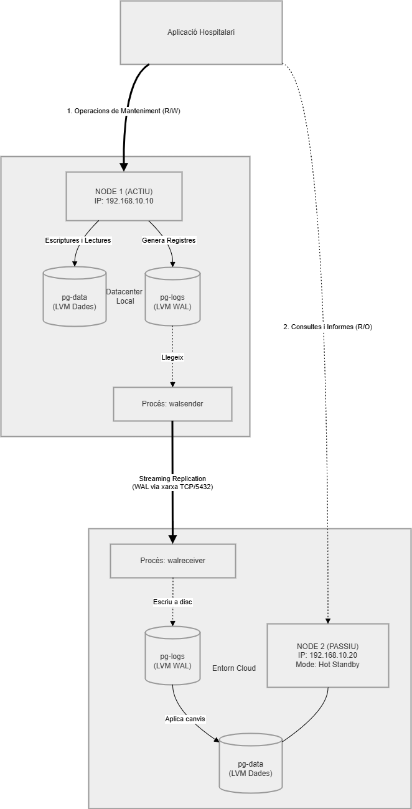

# 1. Especificació de la Infraestructura de Maquinari i Justificació

Per complir amb el requisit de l'alta disponibilitat de l'Hospital i assegurar el rendiment, s'ha dissenyat una arquitectura redundant basada en dos nodes (Actiu-Passiu) amb una segmentació avançada de l'emmagatzematge mitjançant LVM2.

## 1.1 Servidors de Base de Dades (Nodes Redundants)

S'han desplegat dues màquines virtuals amb especificacions idèntiques. El Node 1 actua com a servidor principal al Datacenter local, amb IP 192.168.10.10, mentre que el Node 2 es troba en un entorn que mimetitza una infraestructura Cloud, amb IP 192.168.10.20.

* **Sistema Operatiu:** Ubuntu Server 24.04.2 LTS (Noble Numbat).
* **Processador (CPU):** 4 nuclis (vCPUs)
* **Memòria RAM:** 8.192 MB (8 GB), dimensionada per suportar el *buffer cache* necessari per a consultes massives.
* **Xarxa:** Adaptador Intel PRO/1000 MT en mode "Xarxa NAT" (vLAN «HOSPITAL»), configurat per a connexions segures via SSL.

## 1.2 Arquitectura d'Emmagatzematge Multi-Disc (LVM2)

La solució utilitza una arquitectura de 6 discos independents gestionats per LVM2. Aquesta segmentació és una pràctica de producció crítica per evitar colls d'ampolla d'I/O (Entrada/Sortida).

| Unitat | Volume Group (VG) | Logical Volume (LV) i Punt de muntatge | Mida | Finalitat Tècnica |
| :--- | :--- | :--- | :--- | :--- |
| **sda** | `vg_sistema` | `/`, `/var`, `/tmp`, `/home`, `swap` | 30 GB | OS i aïllament de directoris crítics del sistema. |
| **sdb** | `vg_pgbinaris` | `/opt/postgresql` | 10 GB | Binaris i llibreries de PostgreSQL 18.3. |
| **sdc** | `vg_pgdata` | `/var/lib/postgresql/data` | 40 GB | Directori principal de dades (PGDATA). |
| **sdd** | `vg_pgfast` | `/var/lib/postgresql/fastdata` | 40 GB | Tablespaces d'alt rendiment per a taules crítiques. |
| **sde** | `vg_pglogs` | `/var/log/postgresql` | 15 GB | Logs de sistema i Write-Ahead Logs (WAL). |
| **sdf** | `vg_pgbackup` | `/var/backups/postgresql` | 50 GB | Magatzem per a les 5 còpies de seguretat diàries. |

## 1.3 Justificació Professional de la Solució

L'elecció d'aquesta infraestructura es fonamenta en els següents pilars de l'administració de sistemes:

1.  **Optimització del Throughput d'E/S:** En separar físicament els WAL (`sde`) de les dades (`sdc`), les escriptures seqüencials de transaccions no competeixen amb les lectures aleatòries del personal mèdic, garantint el rendiment exigit.
2.  **Alta Disponibilitat i Disaster Recovery:** La configuració actiu-passiu garanteix que el Node 2 pugui assumir el servei 24x7 si el Datacenter local pateix un desastre físic.
3.  **Fiabilitat amb LVM2:** L'ús de volums lògics permet la creació de snapshots consistents per a backups i la capacitat d'ampliar qualsevol disc "en calent" (sense aturar el servei) si l'hospital creix.
4.  **Aïllament de Fallades:** Si el disc de backups o de logs s'omple, el volum arrel (`/`) romandrà operatiu, evitant que el sistema operatiu col·lapsi i permetent la intervenció de l'administrador.

# 2. Esquema d'Alta Disponibilitat: Rèplica i Administració

Aquest apartat detalla la configuració tècnica de la rèplica física entre el Node 1 (Actiu) i el Node 2 (Passiu), així com els procediments per a la seva administració i verificació de funcionament.

## 2.1 Diagrama de Funcionament de la Rèplica

El sistema utilitza una arquitectura de Streaming Replication Física asíncrona.



### Flux de dades:
1. Les aplicacions realitzen les operacions d'escriptura exclusivament al **Node 1 (192.168.10.10)**.
   
2. El procés `WAL writer` registra aquests canvis al disc dedicat `pg-logs`.
   
3. El procés `walsender` del Node 1 transmet els registres WAL de forma contínua a través de la xarxa.
   
4. El procés `walreceiver` del Node 2 rep les dades i les aplica en temps real al seu emmagatzematge local.

## 2.2 Manual d'Instal·lació de la Rèplica

A continuació es detallen els passos executats als servidors per establir la sincronització:

### Pas 1: Configuració del Node 1 (Actiu)
1. Creació de l'usuari de replicació:
   Es crea un rol específic amb permisos exclusius per a la rèplica.
   ```sql
   CREATE ROLE replicador WITH REPLICATION PASSWORD 'P@ssw0rd' LOGIN;
2. Ajust de paràmetres a `postgresql.conf`
   
   Es configura el servidor per permetre connexions de rèplica i es defineix el nivell de WAL necessari.
   `listen_addresses = '*'`
   `wal_level = replica`
   `max_wal_senders = 10`
   
4. Autorització a `pg_hba.conf`:

   Es permet que el Node 2 es connecti amb l'usuari creat mitjançant xifratge segur. S'afegeix aquest codi a la part de replicadors:
   host    replication     replicador      192.168.10.20/32        scram-sha-256

5. Reinici del servei: `sudo systemctl restart postgresql`.

### Pas 2: Configuració del Node 2 (Passiu)
1. Aturada del servei i neteja de directoris:
   `sudo systemctl stop postgresql`
   `sudo rm -rf /var/lib/postgresql/data/*`

2. Clonació amb `pg_basebackup`:
   
Executem la còpia base incloent el fitxer de configuració de recuperació:
`sudo -u postgres pg_basebackup -h 192.168.10.10 -D /var/lib/postgresql/data/ -U replicador -P -R --slot=node2_slot`

4. Arrencada del servei: `sudo systemctl start postgresql`.

# 3: Verificació del sistema
1. Comprovar l'estat de la replicació (Node 1)

   L'administrador ha d'executar aquesta consulta per verificar que el Node 2 està connectat i rebent dades.:
   `sudo -u postgres psql`
   ```sql
   SELECT client_addr, state, sent_lsn, write_lsn, flush_lsn, replay_lsn FROM pg_stat_replication;```

3. Comprovar el mode recuperació (Node 2)
 
   El Node 2 ha d'estar en mode "Hot Standby" (només lectura):
   ```sql
   SELECT pg_is_in_recovery();
   ```
   Aquesta comanda ha de retornar 't' (true)

# 4. Tècnica de Balanceig Definida

Per a aquest projecte, s'ha definit una tècnica de balanceig a nivell d'aplicació:  

- Les operacions de manteniment (escriptura) s'enviaran sempre a la IP del Node 1.

- Les operacions de consulta i informes es podran distribuir entre ambdós nodes per alleujar la càrrega del servidor principal.

- En cas de caiguda del Node 1, s'haurà de realitzar un failover manual promovent el Node 2 a actiu mitjançant la comanda `pg_ctl promote`.


# 5. Automatització de Còpies de Seguretat

Per garantir la recuperabilitat, s'ha implementat un sistema de còpies de seguretat automàtic. Seguint les millors pràctiques d'administració, s'aplica una estratègia híbrida recomanada que combina la còpia d'objectes globals del clúster i la còpia específica de la base de dades en format custom.

Totes les còpies s'emmagatzemen al volum LVM dedicat (`/var/backups/postgresql`), aïllades del sistema operatiu i de les dades en viu.

## 5.1 Script de Backup Híbrid en Bash

L'script s'ha creat a la ruta `/opt/scripts/backup_hospital.sh`. Executa dues accions principals: salva els rols i usuaris amb `pg_dumpall --globals-only`  i posteriorment fa un `pg_dump -Fc` de la base de dades `hospital` per permetre futures restauracions selectives de taules.

```bash
#!/bin/bash

DATA=$(date +%Y%m%d_%H%M)
DIR_BASE="/var/backups/postgresql"
DEST="$DIR_BASE/backup_$DATA"

# Creació del directori per a la còpia del dia
mkdir -p $DEST

# Backup d'objectes globals (Usuaris, Rols, Tablespaces)
sudo -u postgres pg_dumpall --globals-only -f $DEST/globals.sql

# Backup de la base de dades 'hospital' en format custom
sudo -u postgres pg_dump -Fc -d hospital -f $DEST/hospital.dump

# Rotació: Mantenir només les darreres 5 còpies al disc local
cd $DIR_BASE
# Llista els directoris per ordre temporal, es salta els 5 primers i esborra la resta
ls -1td backup_* | tail -n +6 | xargs rm -rf 2>/dev/null

echo "[$(date)] Còpia $DEST completada. Enviant copia a Node 2"
# Copiem el directori generat al Node 2
scp -r "$DEST" root@192.168.10.20:"$DIR_BASE/"
```

## 5.2  Programació de la Tasca
S'ha configurat el crontab de l'usuari root per executar aquest script cada nit a les 02:00h, assegurant que el sistema mantingui l'històric actualitzat sense necessitat d'intervenció manual per part de l'equip TIC de l'hospital. 

`0 2 * * * /bin/bash /opt/scripts/backup_hospital.sh`

# 6. Restauració del Sistema
Seguint els requeriments del projecte, s'ha creat un script de restauració que permet tant la recuperació total del clúster com la recuperació selectiva de taules crítiques.
## 6.1 Script de Restauració Interactiu

Aquest script, situat a `/opt/scripts/restaurar_hospital.sh`, utilitza l'eina `pg_restore` per processar els fitxers de backup generats prèviament.
```bash
#!/bin/bash
# Configuració
DIR="/var/backups/postgresql"
BD="hospital"

# Selecció del backup
ls -d $DIR/backup_*
read -p "Escriu el nom de la carpeta de backup a restaurar: " FOLDER
RUTA="$DIR/$FOLDER"

# Restaurar Rols i Usuaris (Globals)
# Necessari perquè el sistema reconegui els permisos de l'esquema de seguretat
sudo -u postgres psql -f "$RUTA/globals.sql"

# Restaurar tota la Base de Dades
# Primer eliminem la versió actual per evitar conflictes
sudo -u postgres dropdb --if-exists $BD

# Creem i restaurem la base de dades des del fitxer .dump
# -C (crea la BD), -d postgres (es connecta a la principal per fer la creació)
sudo -u postgres pg_restore -C -d postgres "$RUTA/hospital.dump"

echo "Restauració finalitzada correctament."
```
## 6.2 Verificació Post-Restauració
Un cop finalitzat l'script, l'administrador ha de validar que el servei és operatiu:

1. Accés: Intentar fer login amb l'usuari `ua-admin`.  

2. Dades: Verificar el recompte de pacients: `SELECT count(*) FROM hospital.pacient;`.